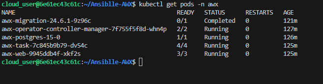
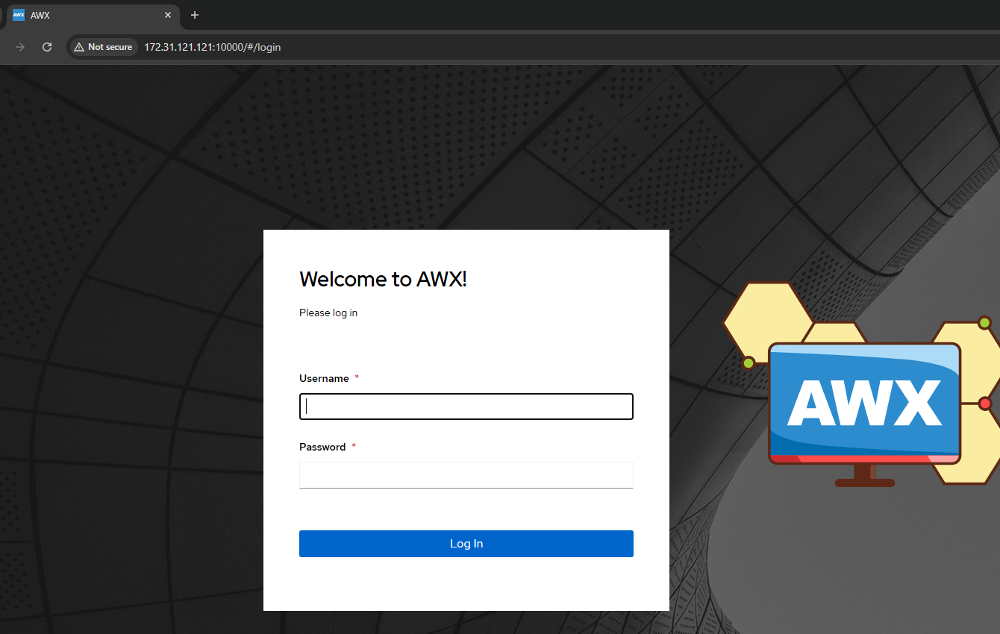
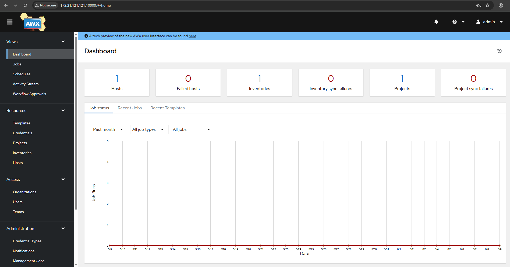

# 📦 AWX Deployment Using AWX Operator and Helm 


#### ⚠️ Work-in-progress learning project — issues expected, improvements ongoing


## 📖 Overview

This project demonstrates deploying AWX (Ansible Web eXecutable) on a Kubernetes cluster using the AWX Operator Helm chart.
AWX is an open-source web-based UI for managing Ansible automation.

## 📋 Prerequisites

A Kubernetes cluster (local or cloud)

kubectl configured to access your cluster

Helm 3 installed

Basic knowledge of Kubernetes and Helm

## 🚀 Installation Steps

### 1️⃣ Create the AWX Namespace

```console
kubectl create ns awx
```

### 2️⃣ Add the AWX Operator Helm Repository

```console
helm repo add awx-operator-helm https://ansible-community.github.io/awx-operator-helm/
```

```console
helm repo update
```

### 3️⃣ Prepare Configuration

A configuration file named awx-values.yaml is included in this repository.
It defines deployment settings like service type, PostgreSQL connection details, and admin credentials.

Important: Before deploying, review and update the awx-values.yaml file — especially the AWX.postgres.password field.

### 4️⃣ Install AWX Operator and AWX
Run this Helm install command:

```console
helm install my-awx-operator awx-operator-helm/awx-operator --version 3.1.0 -n awx -f awx-values.yaml --set AWX.postgres.password="YourStrongPassword"
```

### 5️⃣ Verify Deployment
Check pod status by running:

```console
kubectl get pods -n awx
```

Wait until all pods show Running or Completed.



### 6️⃣ Access AWX
Forward the AWX web service port to your local machine:

```console
kubectl port-forward svc/awx-service -n awx 10000:80 --address=0.0.0.0
```

Then open your browser and go to: 

```console
http://localhost:10000
```



Login using the admin username and password configured in your awx-values.yaml file.



## 🛑 Known Issues & Resolutions

### 📌 1️⃣ Inotify Watch Limit Reached Error

#### Problem: Failed to JSON parse a line from worker stream. Error: Expecting value: line 1 column 1 (char 0) Line with invalid JSON data: b''

AWX may fail to start or show errors due to the default inotify watch limit being too low on the host system.

#### Solution:

Increase inotify limits on your host machine:

```console
Increase inotify limits on your host machine:
sudo nano /etc/sysctl.d/99-inotify.conf
```
Add the following lines:

```console
fs.inotify.max_user_instances = 8192
fs.inotify.max_user_watches = 524288
```
Then apply the changes:

```console
sudo sysctl --system
```
Verify current values:

```console
cat /proc/sys/fs/inotify/max_user_instances
cat /proc/sys/fs/inotify/max_user_watches
```
You should see the updated numbers (**8192** and **524288**).

### 📌 2️⃣ How to Retrieve AWX Admin Password

#### Problem:

If you forget or didn’t set the AWX Web Console admin password, and one was auto-generated during installation.

#### Solution:

Retrieve it from the Kubernetes secret:

```console
kubectl get secret awx-admin-password -n awx -o jsonpath="{.data.password}" | base64 --decode
```
This will print the admin password to your terminal.


## 📖 Additional Help


AWX Official Documentation: https://awx.readthedocs.io/en/latest/

AWX Operator Helm Chart Repo: https://github.com/ansible/awx-operator


